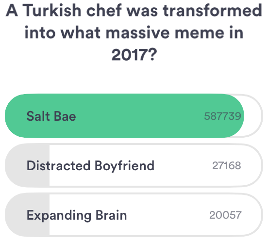

# HQ Trivia Solver
---
Created an HQ trivia solver during HackUTD 2018.

## Background
---
- ## **What is HQ?**

   HQ is a trivia game where a speaker asks questions **_live_**  
      and you're given a short amount of time to answer the questions.  
   
     
   
   There is a cash prize but only the few that answers **EVERY** question correctly are eligible to claim the prize.  
   The prize can range anywhere from **$1200** to more than **$50,000** and the ones that answer every question correctly split the pot.  
   Depending on the prize at stake, the speaker asks anywhere from 8 to 15 questions.   

- ## **Why this project?**

   At the time of the hackathon, HQ was getting **very** popular and I couldn't hear enough about it.  
   As the hackathon was approaching, I was banging my head for some ideas that I could implement.  
   You might've guessed by now what I decided to build. One afternoon before the hackathon, I  
   humored the idea of building an HQ trivia solver but I had thought it was way out of my range  
   of skills. Despite the lack of confidence, I decided at the last minute to build the application!

- ## **How long did it take?**

   Since HackUTD was my first hackathon and I wasn't completely settled on what to build, I spent  
   most of the time looking at some of my friends interesting projects, and workshops hosted by various sponsors.  
   Once I had decided to build the trivia solver, I started to develop at **midnight** when the deadline was  
   at **noon** giving me only about **12 hours** to go from empty directory to presentable. Despite the  
   constraints, I was able to pull through and make something that I could share with my friends! I think out of  
   all of the fun moments during the hackathon, my favorite was bringing something that I had built **by myself**  
   and presenting the final product and explaining how it work to my friends!  

## Development
---
- ## **What were the steps?**

   The first step was to somehow get the image of the question and the answer choices. Since HQ is a mobile app  
   and I did not yet know how to grab the image directly from the screen of the phone, I used the image found in the  
   background section as a test for development.

   Next, I had to find a way to take the image and extract the text from the image. Because at the hackathon  
   Google Cloud Platform was mentioned, I thought I could possibly find a tool in there to get a 
